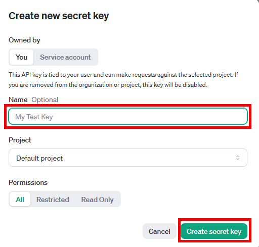
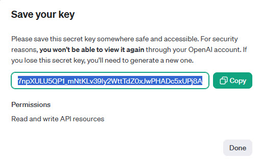

# Configure LLM Connection String

In order to make it easier to switch between Azure OpenAI deployments and OpenAI, the labs use a connection string. Below are the pieces of information you will need to configure the AI services for the lab.

## Azure OpenAI

The application code has the following template in the appsettings.Local.json file for an AzureOpenAI setup:

```json
"OpenAI": "Source=AzureOpenAI;Key=<key>;ChatDeploymentName=chat;TextEmbeddingsDeploymentName=text;Endpoint=https://<resource name>.openai.azure.com/"
```

| Keyword      | Value       |
|----------------|----------------|
| Source | AzureOpenAI |
| ChatDeploymentName | This is the name of your GPT-4o model deployment. For the lab I used a deployment model named **chat** |
| TextEmbeddingsDeploymentName | This is the name of your text-embedding-ada-002 model deployment. For the lab I used a deployment model named **text** |
| Key | This is one of the two keys |
| Endpoint | This is the endpoint of your Azure OpenAI service |

More detail on these settings can be found at [Retrieve key and endpoint](https://learn.microsoft.com/en-us/azure/ai-services/openai/quickstart?tabs=command-line%2Cjavascript-keyless%2Ctypescript-keyless%2Cpython-new&pivots=programming-language-python#retrieve-key-and-endpoint) and [Deploy a model](https://learn.microsoft.com/en-us/azure/ai-services/openai/how-to/create-resource?pivots=web-portal#deploy-a-model)

## Open AI

The application code has the following template in the appsettings.Local.json file for an OpenAI setup:

```json
"OpenAI": "Source=OpenAI;ChatModelId=gpt-4o-2024-08-06;TextEmbeddingsModelId=text-embedding-ada-002;ApiKey=<api key>"
```

| Keyword      | Value       |
|----------------|----------------|
| Source | OpenAI |
| ChatModelId | gpt-4o-2024-08-06 |
| TextEmbeddingsModelId | text-embedding-ada-002 |
| ApiKey | Your API Key |

In order to create an API key:

1. Login to https://platform.openai.com

2. Go to the **Dashboard**

3. Go to the **API Keys** menu item, click on the **Create new secret key**


4. Give you key a **name** and click **Create secret key**



5. Make sure you copy the value in the **Save your key** dialog box (this is what is used in the connection string above)

